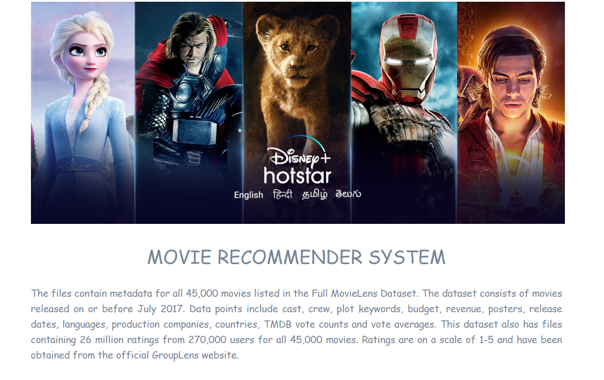
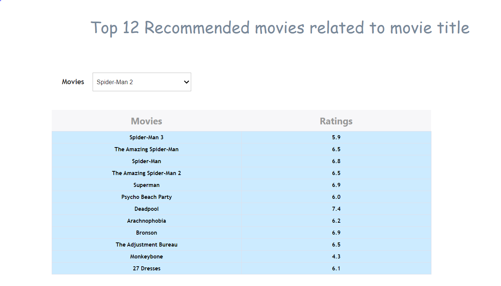
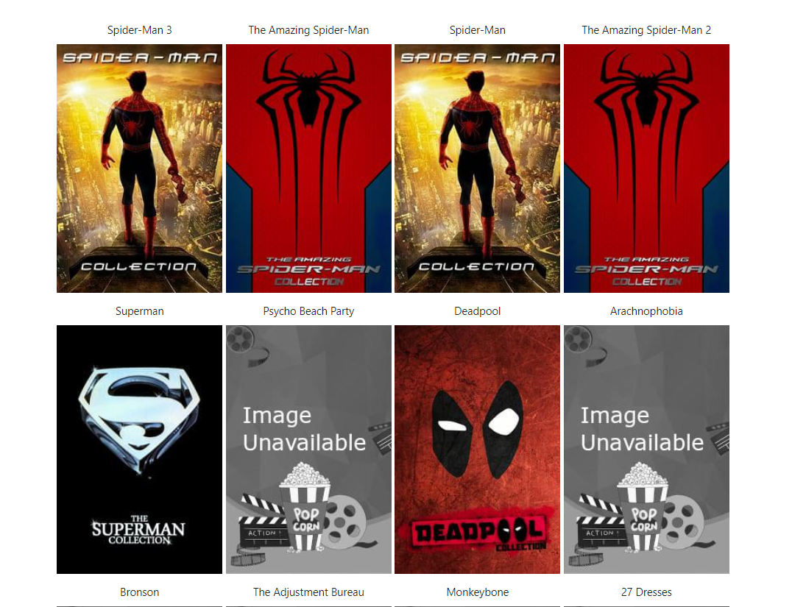
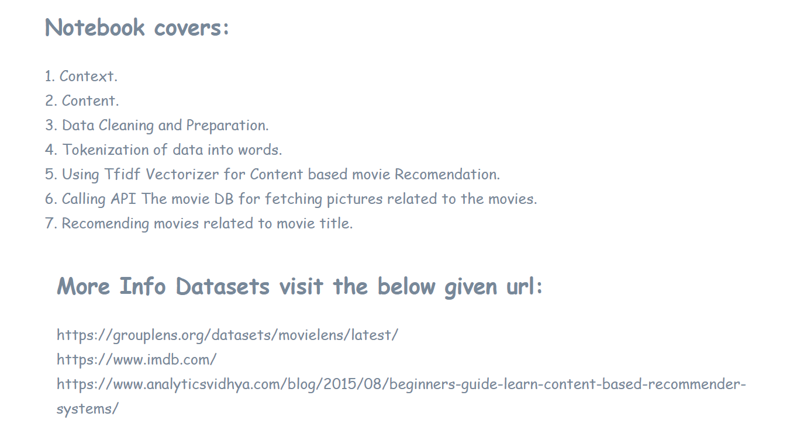

# Movie Recommender System
# Data Repository
https://grouplens.org/datasets/movielens/latest/

# Required Installations
1. pip install requests  
2. pip install responses
3. pip install ipywidgets (https://ipywidgets.readthedocs.io/en/latest/user_install.html)
4. pip install voila

# Challanges
1. When API get so many hits at a time on its server it will throw you connection error, In testing phase you many face this issue or when innternet connection will not work.
2. While using the the API of movieDB - there are so many movies which does not have the movie poster in the database of the movieDB. This need to resolved, so created the local default poster. In case of when posters are not recived from the API then setting the default poster from our end.

# For Hosting the Jupyter NoteBook 
1. Used Voila 

# How to connect with movieDB API 
1. Create an account in the MovieDB- https://www.themoviedb.org/
2. Generate the API key- which is unique for Every user.
3. Using that API key use the requried web services.
4. And Voila !!! Ready to use the API.
